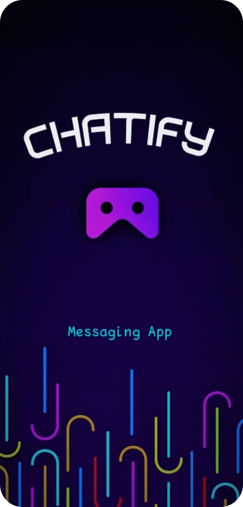
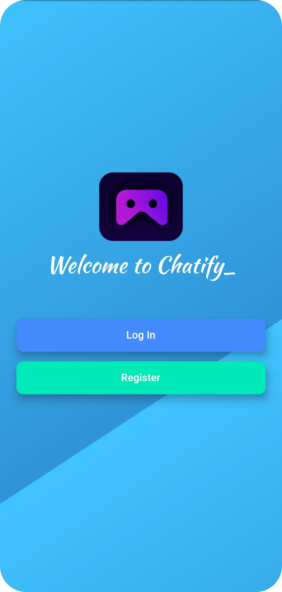
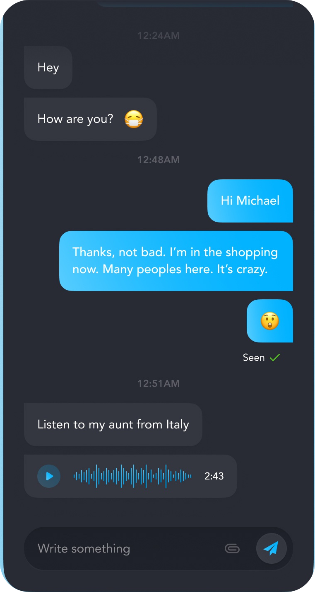

# Chatify

A Firebase Powered Messaging Flutter application.

# How The App will look 

      
 
 # Features of the App
  
  Many users can chat using this app.
  
  The app incorporates Firebase. I am using Firebase Cloud Firestore as well as the Firebase authentication package to equip chatify with a cloud-based NoSQL database and secure authentication methods.
  
  
  
 1) Incorporate Firebase into this Flutter app.
 2) Firebase authentication to register and sign in users.
 3) Created beautiful animations using the Flutter Hero widget.
 4) Created custom aniamtions using Flutter's animation controller.
 5) Concept of mixins and how they differ from superclasses.
 6) Concepts of Streams and how they work.
 7) Uses ListViews to build scrolling views.
 8) Uses Firebase Cloud Firestore to store and retrieve data on the fly.
  

## Getting Started

A few resources to get you started if this is your first Flutter project:

- [Lab: Write your first Flutter app](https://flutter.dev/docs/get-started/codelab)
- [Cookbook: Useful Flutter samples](https://flutter.dev/docs/cookbook)

For help getting started with Flutter, view our
[online documentation](https://flutter.dev/docs), which offers tutorials,
samples, guidance on mobile development, and a full API reference.
